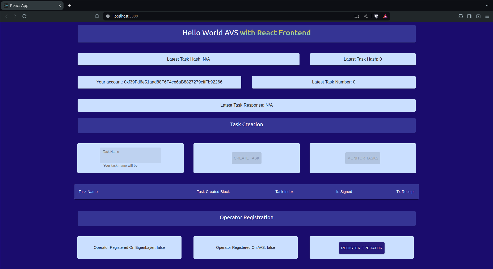

# Hello World AVS with React JS

Welcome to the Hello World AVS, this repo is a fork of the original with some added React.js frontend code to interact with the on-chain component

This project shows you the simplest functionality you can expect from an AVS.

It will give you a concrete understanding of the basic components.


There are 5 steps to this AVS:
- AVS consumer requests a "Hello World" message to be generated and signed
- AVS takes on the request by emitting an event for operators to pick up the request
- any operator who is staked to serve this AVS takes this request, generates this message and signs it
- the operator submits this message with their signature back to the AVS
- *if the operator is in fact registered to the AVS and has the minimum needed stake, the submission is accepted*

That's it. This simple flow highlights some of the core mechanics of how AVSs work.

Where additional sophistication with AVSs come into the picture:
- the nature of the request is more sophisticated than generating a constant string
- the operators might need to coordinate with each other
- the type of signature is different based on the constraints of the service
- the type and amount of security used to secure the AVS
- and so on...

## Quick Start

- NB: The PRIVAE_KEY in the env var is used to sign txs on the local chain, it was included in the .env vars on purpose but not for production use

- What the WebApp looks like:


- How the WebApp can be used:


### Dependencies

1. [npm](https://docs.npmjs.com/downloading-and-installing-node-js-and-npm)
2. [Foundry](https://getfoundry.sh/)
3. [Docker](https://www.docker.com/get-started/)

### Steps

1. Make sure Docker is running
2. Run `yarn install`
3. Run `make start-chain-with-contracts-deployed`
    * This will build the contracts, start an Anvil chain, deploy the contracts to it, and leaves the chain running in the current terminal
4. Run `cd base-react-app` followed by `npm i` (to install react dependencies) followed by `npm run start`
    * Instead of running the stand-alone operator software as in the original repo, we just run the React server (AVS code was moved into React)
5. Use the buttons to control the AVS  software
    * Start by Registering the oeprator `Register Operator`; followed by `Monitor Tasks`; then enter any task name and click on `Create Task`

### React Code (Addon to the original repo)
- We moved the ABI code inside the /src folder because React cannot read files and folders outisde its /src directory
- For simplicity we moved the AVS code into App.js, and removed the type definitions 
- We added an env var into the base-react-app folder and copied over the env var values from .env.anvil, in React all env var names need to be preceded by: `REACT_APP_` so we rename the variables
- We move our const declarations outside our main class along with some custom styling definitions,
the custom styles have their colors taken from the EigenLayer website color scheme
- We have one main App class that contains the AVS code in separate functions
- The data that can be retreived on chain will be fetched using ethers JS and the HelloWorld smart contract address
- The data that is not saved on-chain such as the task name is saved in app state, which is stored in session storage everytime it is udpated
in order to survive a page refresh or re-navigation. Session storage is deleted when the server is shut down

## Extensions

- Operator needs a minimum stake amount to make submissions
- Add another strategy to the AVS
- Operator must respond within a certain number of blocks

## Deployment on Holesky

To deploy the Hello World AVS contracts to the Holesky network, follow these steps:

1. Ensure you have the necessary RPC URL and private key for the Holesky network.
2. Run the deployment script using Foundry:
    ```bash
    forge script script/HoleskyDeployer.s.sol:HoleskyDeployer --rpc-url $RPC_URL --private-key $PRIVATE_KEY --broadcast -vvvv
    ```
    Replace `$RPC_URL` with your Holesky RPC URL and `$PRIVATE_KEY` with your private key.
    If you want to use it with react make sure the env vars are properly names (names starting with `REACT_APP_`)

## Adding a New Strategy

To add a new strategy to the Hello World AVS, follow the guide provided in [`AddNewStrategy.md`](https://github.com/Layr-Labs/hello-world-avs/blob/master/AddNewStrategy.md). This guide walks you through the necessary steps to add and whitelist a new strategy for the AVS.